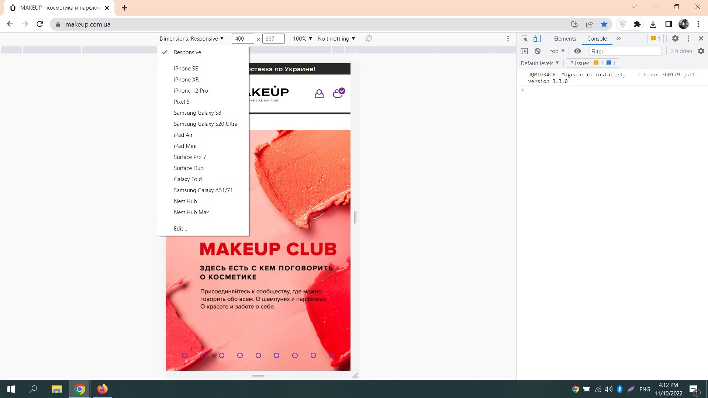
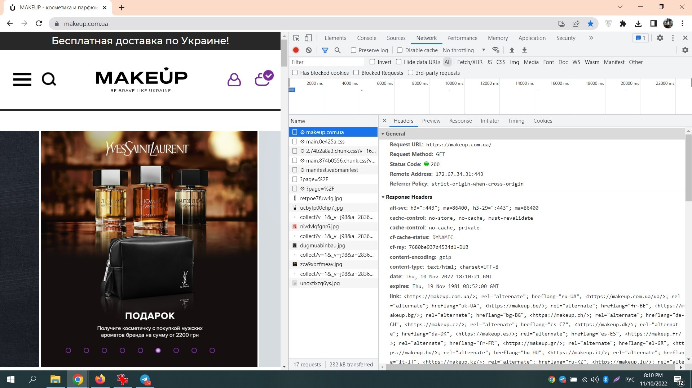
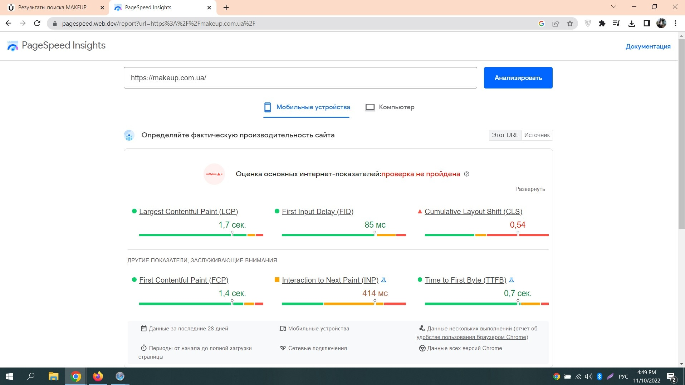
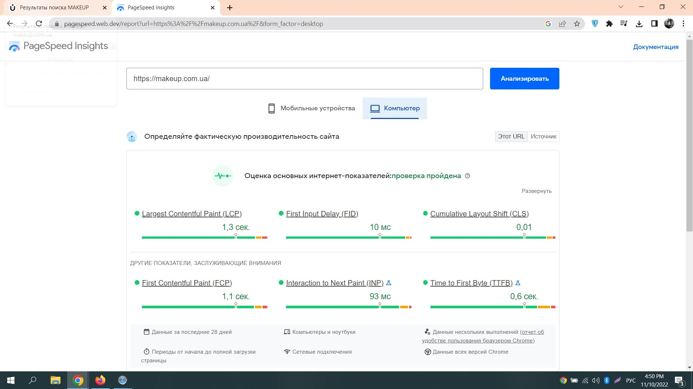
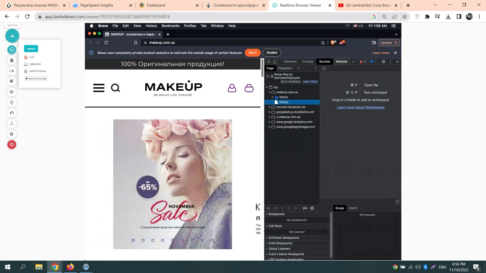
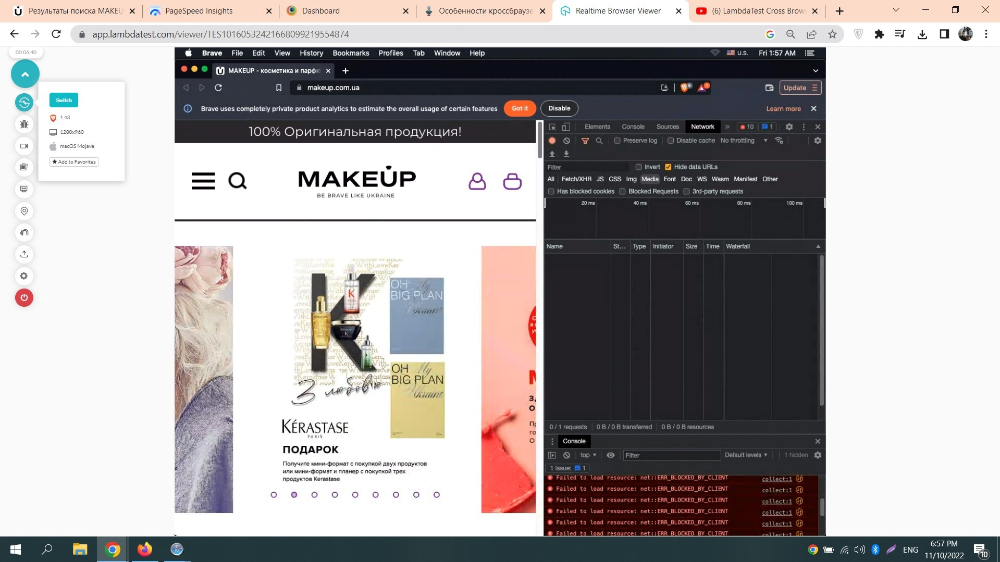
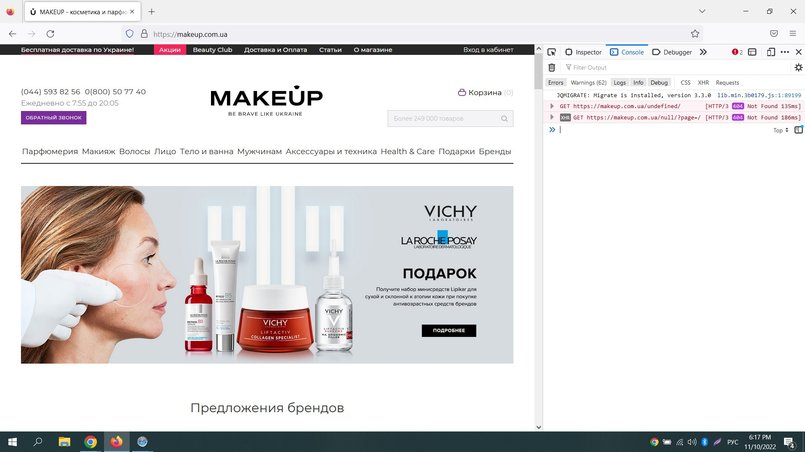

<h2>Тестовая стратегия Веб - приложение MAKEUP  https://makeup.com.ua/</h2>

Функциональной особенностью приложения MAKEUP  является  возможность выбора и приобретения широкого ассортимента товаров бъюти индустрии.

Критический функционал данного приложения:  каталог товаров, описание товаров, корзина и личный кабинет пользователя.

В данном случае  по знанию системы будет проводиться  тестирование методом черного ящика  ввиду того что у нас нет доступа к коду.

По уровням планируется провести:

<ul>
    <li>системное тестирование - проверить поведение и возможности системы  в целом.</li>
    <li>приемочное тестирование -оценить  соответствует ли продукт заявленным требованиям.</li>
</ul>

По целям  проведем функциональное и не функциональное  тестирование,  по позитивности сценария : позитивное и негативное тестирование.

Тестирование будет проводиться с помощью такой документации как чек-листы и тест - кейсы.

<h3>1. Функциональное тестирование.</h3>

При функциональном тестировании проведем проверку работоспособности критического функционала , GUI  и тестирование взаимодействия.

Проведем проверку  внутренних и внешних ссылок, форм.

<ul>
    <li>проверка работоспособности внутренних ссылок на всех разделах сайта </li>
    <li>проверка работоспособности внешних ссылок на всех разделах сайта</li>
    <li>проверка работоспособности форм:
        <ul>
            <li>- при введении корректных данных  в поля форм</li>
            <li>- при введении не корректных данных в поля форм</li>
        </ul>
    </li>
</ul>
<h4>Тестирование GUI</h4>

Тестирование  пользовательского  интерфейса   проводится с целью проверки соответствия  графическому интерфейсу приложения.

<ul>
    <li>проверка соответствия  GUI  дизайну</li>
    <li>проверка кроссбраузерности / кроссплатформенности</li>
    <li>проверка с помощью разных разрешений экрана</li>
</ul>
<h3>2. Тестирование производительности.</h3>

Проводится  с целью  проверить работоспособность приложения в разных условиях использования и нагрузок.

<ul>
    <li>нагрузочное тестирование  - проверка времени отклика приложения на различные запросы, с целью, удостоверится,что продукт работает удовлетворительно при обычной пользовательской нагрузке.</li>
    <li>тестирование надежности и восстановления после сбоев - работоспособности приложения после всевозможных видов сбоев, связанных с ошибкой программного обеспечения, ошибкой связи либо отказа оборудования.</li>
    <li>тестирование стабильности - проверка работоспособности приложения при длительной  работе по времени и нормальной рабочей нагрузке.</li>
    <li>стресс- тестирование - проверка работоспособности приложения при нагрузках,превышающих  обычную пользовательскую нагрузку в несколько раз.</li>
</ul>
<h3>3. Тестирование удобства использования.</h3>

Проводится для оценки продукта со стороны удобства использования конечным пользователем.

Тест должен покрывать следующие требования:

<ul>
    <li>приятный, ненавязчивый  интерфейс приложения</li>
    <li>понятность и простота использования приложения</li>
    <li>контент не содержит грамматических и орфографических ошибок</li>
    <li>иллюстрации на сайте  соответствуют содержанию и описанию</li>
</ul>
<h4>Тестовое окружение:</h4>

MS Windows 10  Chrome/105.0.0.0

Firefox  106.0.5

Приемочное тестирование можно проводить на том же наборе тестов, которые использовались в системном тестировании.

На этом уровне принимается решение соответствует ли данный продукт заявленным требованиям,  передавать ли его в продакшн.

<h4>Инструменты:</h4>

<a href="https://pagespeed.web.dev/">https://pagespeed.web.dev/</a> - проверить скорость загрузки страницы

<a href="https://app.lambdatest.com/">hhttps://app.lambdatest.com/</a>проверка кроссбраузерности /кроссплатформенности 

<h4>Описание процесса:</h4>

Запускаем в Chrome devTools  Toogle device toolbar

Можно изменять ширину вьюпорта, масштаб, плотность пикселей, выбрать мобильное устройство или десктоп, поворот экрана.

Network - Headers

С помощью инструмента  Pagespeed  проверяем скорость загрузки страницы  на мобильном устройстве и на компьютере

С помощью инструмента Лембдатест   тестируем сайт на различных браузерах

MAC OC Mojave

В браузере Firefox  запускаем инструменты разработчика - консоль

вкладка Network

